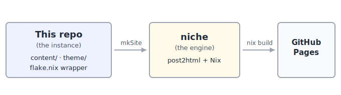

**This blog is two repos, not one.** What you are reading lives in a small content repo: the posts, a theme, and a thirty-line Nix flake❄Nix flakeA self-contained Nix project with pinned inputs and a standard output schema, giving fully reproducible builds.. The machinery that turns that into a website lives in a separate project, [[niche|niche]].

I split it on purpose. The content should not know how it is built, and the build tool should not know what I write about. This page is the colophon for the content side. The [[niche|niche]] post is the engine.

## Instance and engine

The **instance** is this repository. It holds:

- **`content/`** — one directory per post: a `meta.nix` (title, date, tags, summary as a pure Nix attribute set) and a `post.md`. Some posts add an `assets/` dir or a `figures.nix`.
- **`theme/`** — TeraTTeraA Rust templating engine with Jinja2-style syntax, used to render HTML pages from data.<a href="https://keats.github.io/tera/" target="_blank" rel="noopener">keats.github.io</a> templates plus CSS and self-hosted fonts. Here that is a local copy of niche's `fancy-sidebar` theme, with a MathJax include bolted on.
- **`flake.nix`** — the wrapper. It calls `niche.lib.mkSite { contentDir = ./content; themeDir = ./theme; siteConfig = ...; }`, then adds the `CNAME` and `.nojekyll` that GitHub Pages needs.

That is the whole instance. No generator code, no pipeline, no Rust. Pull the `niche` input, hand it three arguments, get a site.

The **engine** is niche: a Rust binary (`post2html`) wrapped by Nix, built as a compile/link/compose toolchain. If you want the architecture, the caching model, and the bugs it was born from, read the [[niche|niche]] post.

## Design principles

The visual design is typography-first: generous whitespace, a minimal palette, nothing competing with the text.

- **Inter** for body text, **JetBrains Mono** for code. Self-hosted as woff2FWOFF2Web Open Font Format 2.0: a Brotli-compressed web-font format that shrinks font files for faster page loads., no CDNNCDNContent Delivery Network: geographically distributed servers that cache and serve assets close to the reader..
- **Dark mode** with a small toggle, persisted in `localStorage`, defaulting to your OS preference.
- No CSS framework. CSS custom properties for theming. One `main.css`, one `code.css`.
- Valid HTML5, semantic elements, OpenGraphogOpenGraphA metadata protocol (og: meta tags) that controls how a link's title, image, and description render when shared.<a href="https://ogp.me/" target="_blank" rel="noopener">ogp.me</a> tags, an Atom feed⚛Atom feedAn XML syndication format that lets readers subscribe to a site's updates through a feed reader., canonical URLs.
- **Minimal JavaScript**: the dark-mode toggle, plus [MathJax](https://www.mathjax.org/) for math. The content itself is static HTML and CSS.

Because a theme is only read during the engine's compose phase, editing a template or a stylesheet never rebuilds a post. Only the final assembly reruns. That is why fiddling with CSS is cheap.

## What AI built here

The content and the theme were designed and written by an AI (Claude, Opus), working interactively with a human (Mark). Every post, the theme templates, the CSS, the flake wrapper: all generated, all reviewed. Each change passed an architectural-review agent and a QA agent before it was committed.

The engine was built the same way, in its own repo, with its own PRDPPRDProduct Requirements Document: a written spec of what a product must do, its goals, and its constraints., backlog, and review trail. The mistakes it made along the way (a source filter that broke incremental builds, a batched-compilation dead end) are worth reading: they are in the [[niche|niche]] post.

## Source

Two repositories tell the whole story:

- **This instance** — content, theme, and the flake wrapper: [github.com/eisbaw/eisbaw.github.com](https://github.com/eisbaw/eisbaw.github.com).
- **The niche engine** — the Rust binary, the Nix library, the PRD, and the backlog: [github.com/eisbaw/niche](https://github.com/eisbaw/niche).

`git log` in either one is honest about how it got here. Start with the [[niche|niche]] post if you want to know how the site is actually built.
