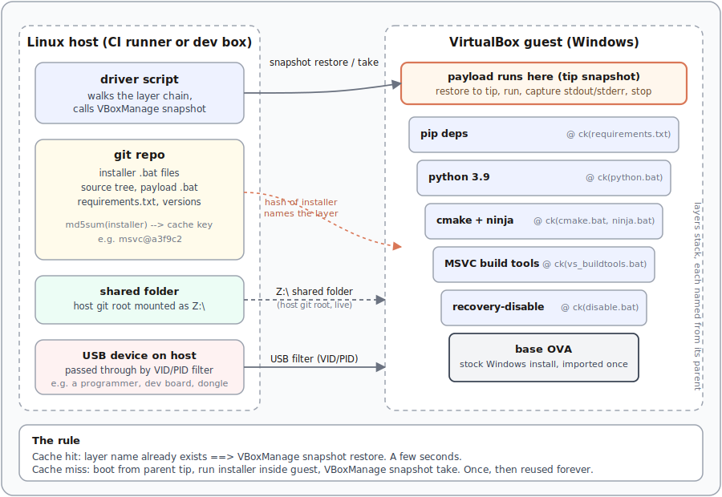

**A small BASH library turns a Windows VirtualBox VM into a stack of cacheable snapshot layers, keyed on the installer's hash.** Change one installer, only that layer and its descendants rebuild. Everything else is a free restore.

I wrote it for a cross-platform project that has to ship a Windows binary from Linux CI. If you have ever tried to reproduce a Windows build box, you know the pain: <span class="gloss" tabindex="0">MSVC<span class="gloss-card"><span class="gc-head"><span class="gc-chip">C</span><span class="gc-name">MSVC</span></span><span class="gc-body">Microsoft Visual C++: Microsoft's C/C++ compiler and toolchain, the native way to build Windows binaries.</span></span></span>, CMake, <span class="gloss" tabindex="0">Ninja<span class="gloss-card"><span class="gc-head"><span class="gc-chip">N</span><span class="gc-name">Ninja</span></span><span class="gc-body">A small build system designed for speed, usually generated by a higher-level tool like CMake.</span><span class="gc-foot"><a href="https://ninja-build.org" target="_blank" rel="noopener">ninja-build.org</a></span></span></span>, a specific Python, a vendor SDK, all in a specific order, all on a machine nobody wants to own. Nobody handed me one, so I wrote it.

## What it is

Two files, on the Linux host:

- `lib_vbox.bash`: a generic shell library that wraps `VBoxManage`. Import <span class="gloss" tabindex="0">OVA<span class="gloss-card"><span class="gc-head"><span class="gc-chip">📦</span><span class="gc-name">OVA</span></span><span class="gc-body">Open Virtual Appliance: a single portable file (a tar of the virtual disk plus a descriptor) that packages a whole VM for import.</span></span></span>, take <span class="gloss" tabindex="0">snapshot<span class="gloss-card"><span class="gc-head"><span class="gc-chip">📸</span><span class="gc-name">snapshot</span></span><span class="gc-body">A saved point-in-time state of a VM's disk (and optionally memory) that you can restore to later.</span></span></span>, restore snapshot, run a command in the guest, share a host folder into the guest, set up <span class="gloss" tabindex="0">USB passthrough<span class="gloss-card"><span class="gc-head"><span class="gc-chip">🔌</span><span class="gc-name">USB passthrough</span></span><span class="gc-body">Handing a physical USB device on the host directly to the guest VM, so the guest OS drives it as if plugged in locally.</span></span></span>. Reusable across projects.
- `run.sh`: the project-specific integration point. It sources the library, picks which toolchain layers this project needs (recovery-disable, MSVC build tools, CMake, Ninja, Python, pip deps), and drops you into a Windows shell at the tip of the chain.

That is it. No <span class="gloss" tabindex="0">Vagrant<span class="gloss-card"><span class="gc-head"><span class="gc-chip">V</span><span class="gc-name">Vagrant</span></span><span class="gc-body">A tool for building and managing reproducible VM development environments from a config file.</span><span class="gc-foot"><a href="https://www.vagrantup.com" target="_blank" rel="noopener">vagrantup.com</a></span></span></span>, no <span class="gloss" tabindex="0">Packer<span class="gloss-card"><span class="gc-head"><span class="gc-chip">P</span><span class="gc-name">Packer</span></span><span class="gc-body">A tool that bakes identical machine images (VM, cloud, container) from a single source template.</span><span class="gc-foot"><a href="https://www.packer.io" target="_blank" rel="noopener">packer.io</a></span></span></span>, no <span class="gloss" tabindex="0">Ansible<span class="gloss-card"><span class="gc-head"><span class="gc-chip">A</span><span class="gc-name">Ansible</span></span><span class="gc-body">An agentless configuration-management tool that provisions machines by running declarative playbooks over SSH/WinRM.</span><span class="gc-foot"><a href="https://www.ansible.com" target="_blank" rel="noopener">ansible.com</a></span></span></span>, no vendor cloud. Plain OVA plus `VBoxManage` plus bash.

## What it is not

- Not a cross-compiler. This runs the real Windows toolchain, inside a VM.
- Not a Vagrant box catalog. There is no registry, no magic tag names, no `vagrant up`.

## How the layers work

Think of each snapshot as a Docker layer.

The driver script calls `build_snapshot_cached` once per dependency. It hashes the installer files with `sha256sum`, takes the first twelve hex chars, and folds them into the snapshot name. Something like `msvc@a3f9c2d1e0b8 from cmake@71d0aef42b91 from base`. If a snapshot with that exact name exists, restore it and move on. If it does not, boot the VM from the current tip, run the installer, snapshot, and stop.

The rule is the same rule Docker's build cache follows: **the cache key is the content, not the clock.** Change the installer script and the layer invalidates. Descendant layers invalidate with it, because their names embed the parent's name.

In bash the whole cache is small enough to fit on one screen:

```bash
# cache-key: hash the installer files, slice to a short stable id
cache_key() {
    sha256sum $(find "$@" -type f) | awk '{print $1}' | sort | sha256sum | cut -c -12
}

# take a snapshot after the installer runs, or restore if the snapshot exists
build_snapshot() {
    if vbox_snapshot_exists "$VBOX_SNAPSHOT"; then
        vbox_snapshot_restore "$VBOX_SNAPSHOT"    # cache hit
    else
        vbox_vm_start                             # must be idempotent: no-op if VM already running
        vbox_guest_run "$@"                       # run the installer(s)
        vbox_vm_stop                              # stop before snapshotting (see below)
        vbox_snapshot_create "$VBOX_SNAPSHOT"     # cache write
    fi
}
```

A layer entry in `run.sh` names its inputs and its installers:

```bash
build_snapshot_cached "msvc" "y" \
    --ck "ext/vs_buildtools/2019" \
    --cmd 'Z:\ext\vs_buildtools\2019\install.bat' \
    --cmd 'Z:\ext\vs_buildtools\2019\confirm.bat'
```

`--ck` is the cache-key input (files the layer depends on); `--cmd` is the installer to run inside the guest on a miss. The `"y"` flag enables the guest network for that layer (installers download). Turn it off for offline layers.

One empirical detail on `vbox_vm_stop`. <span class="gloss" tabindex="0">VirtualBox<span class="gloss-card"><span class="gc-head"><span class="gc-chip">▣</span><span class="gc-name">VirtualBox</span></span><span class="gc-body">Oracle's free, cross-platform type-2 hypervisor for running guest operating systems in VMs.</span><span class="gc-foot"><a href="https://www.virtualbox.org" target="_blank" rel="noopener">virtualbox.org</a></span></span></span> does support live snapshots: you can call `VBoxManage snapshot take` on a running VM and it will not refuse. It also has a `--pause` flag that briefly suspends the guest. Neither is enough. Guest writes still in flight (the Windows disk cache, the installer's file-close queue) may not have hit the virtual disk yet, and the snapshot captures what is on disk. I have watched a "successful" live-snapshotted layer come back missing files the installer swore it wrote. Powering the VM off drains the guest's writeback and the snapshot is truthful. Slower, but honest.

Here is the shape.



The guest sees the host's git root as `Z:\` via a VirtualBox shared folder. So the installer scripts, the source tree, and any payload `.bat` all live in the repo, get versioned with the code, and are visible from inside the VM without copying. The cache-key is a hash of files on the host; the installer runs on the guest; the artefacts stay in the guest's snapshot layer. Nothing is copied around.

## The shell at the tip

Once the toolchain layers are built, `run.sh` hands control to a Windows shell running from the tip snapshot. Two shapes: pass a `.bat` path as an argument, or pipe cmd.exe lines into stdin and let the driver wrap them into a temp file at the repo root. Either way the driver restores the tip snapshot first, so every invocation starts from a known state. Boot, run, capture stdout and stderr, stop.

What makes this survive CI: a bash trap on `EXIT SIGTERM SIGINT` calls a "stop all VMs" script. When GitLab CI cancels a job or hits the timeout, the VM does not get left running on the runner.

## Where Vagrant leaves off

Vagrant's own docs will tell you: `vagrant-cachier` caches downloaded packages, not installed state. It saves you the download; it does not save you the install. On Windows, install time dwarfs download time. MSVC alone is many minutes of unpacking and registry churn.

This layout is different. **The install itself is what gets cached, as a snapshot.** Second run of a green pipeline restores each layer in seconds. First run per layer pays the install cost once.

The other Vagrant sore point is the box ecosystem. Vagrant wants you to bake heavy "boxes" and share them out of band, referenced by magic tag names. That is not infrastructure-as-code; it is infrastructure-as-a-name-that-points-to-something-elsewhere. Here the project defines and locks its own dependencies in-repo. Clone the repo, run one script, and the box builds itself.

## Hardware in the loop

`VBoxManage` supports USB filter passthrough. The library exposes it as `vbox_usb_add_filter <name> <vendor_id> <product_id>`. Attach a programmer or a dev board to the runner, filter it into the guest, and the vendor's Windows-only flashing tool runs inside the same VM that built the firmware.

```bash
# USB 1.1 (OHCI) ships with base VirtualBox.
# USB 2.0 (EHCI) and 3.0 (xHCI) require the Oracle Extension Pack.
vbox_usb_enable "1.0"
vbox_usb_add_filter "programmer" "0x1234" "0xabcd"
```

The filter matches on the device's USB VID/PID. Any device that plugs in and matches gets captured into the guest. Unmatched USB stays on the host.

## The primitives

If you want to write your own, six primitives on top of `VBoxManage` cover it.

**Snapshot: exists, create, restore, current.** The cache predicate and its writers.

```bash
vbox_snapshot_exists() {
    local name="$1"
    VBoxManage snapshot "$VM_NAME" list | grep -q "$name"
}

vbox_snapshot_create() {
    local name="$1"
    # --pause suspends the guest briefly, but see the vbox_vm_stop note above:
    # we still power off before calling this, or writes may not have flushed.
    VBoxManage snapshot "$VM_NAME" take "$name" --pause
}

vbox_snapshot_restore() {
    local name="$1"
    vbox_vm_stop
    VBoxManage snapshot "$VM_NAME" restore "$name"
}

vbox_snapshot_current_name() {
    VBoxManage snapshot "$VM_NAME" list --machinereadable \
        | awk -F= '$1=="CurrentSnapshotName"{print $2}' | tr -d '"'
}
```

**VM lifecycle, idempotent.** Start is a no-op if already running; stop drains gracefully and only powers off as a last resort. Login-detection requires <span class="gloss" tabindex="0">Guest Additions<span class="gloss-card"><span class="gc-head"><span class="gc-chip">⚙</span><span class="gc-name">Guest Additions</span></span><span class="gc-body">VirtualBox's in-guest driver package that enables shared folders, guest command execution, clipboard sharing, and login reporting.</span></span></span>.

```bash
vbox_vm_is_running() {
    local state
    state=$(VBoxManage showvminfo "$VM_NAME" --machinereadable \
        | awk -F= '$1=="VMState"{print $2}' | tr -d '"')
    [ "$state" = "running" ]
}

vbox_vm_start() {
    vbox_vm_is_running && return 0
    VBoxManage startvm "$VM_NAME" --type headless
    # wait until a user is logged in inside the guest
    while true; do
        local users
        users=$(VBoxManage guestproperty enumerate "$VM_NAME" \
            | awk -F@ '{print $1}' | tr -d "'" \
            | awk -F= '$1 ~ "LoggedInUsers "{print $2+0}')
        [ "${users:-0}" -ge 1 ] && break
        sleep 1
    done
}

vbox_vm_stop() {
    vbox_vm_is_running || return 0
    VBoxManage controlvm "$VM_NAME" shutdown --force
    for _ in $(seq 60); do
        sleep 1
        vbox_vm_is_running || return 0
    done
    VBoxManage controlvm "$VM_NAME" poweroff  # last resort
}
```

**Guest execution.** Run a command inside Windows with the guest credentials.

```bash
vbox_guest_run() {
    for cmd in "$@"; do
        VBoxManage guestcontrol "$VM_NAME" run \
            --username "$GUEST_USERNAME" --password "$GUEST_PASSWORD" \
            --wait-stdout --wait-stderr \
            -- "$cmd"
    done
}
```

**Shared folder.** Mount the host git root as `Z:\` in the guest. Remove any prior mount by that name first, in case the host path changed.

```bash
vbox_guest_mount_gitroot() {
    VBoxManage sharedfolder remove "$VM_NAME" --name "gitroot" 2>/dev/null || true
    VBoxManage sharedfolder add "$VM_NAME" \
        --name "gitroot" --hostpath "$GIT_ROOT_DIR" \
        --automount --auto-mount-point "Z:"
}
```

**The outer wrapper.** Turns file paths and installer commands into a cache-keyed layer name, then delegates to `build_snapshot`.

```bash
build_snapshot_cached() {
    local name="$1" network="$2"; shift 2
    local ck_paths=() cmds=()
    while [ $# -gt 0 ]; do
        case "$1" in
            --ck)  ck_paths+=("$2"); shift 2;;
            --cmd) cmds+=("$2"); shift 2;;
        esac
    done
    local ck; ck=$(cache_key "${ck_paths[@]}")
    export VBOX_SNAPSHOT="${name}@${ck}${network} from $(vbox_snapshot_current_name)"
    VBOX_NETWORK="$network" build_snapshot "${cmds[@]}"
}
```

**Putting it together.** A minimal `run.sh` that stitches the pieces:

```bash
source lib_vbox.bash
export VM_NAME="my-build-box"
export OVA_PATH="./vm/base.ova"
export GUEST_USERNAME=Admin
export GUEST_PASSWORD=verylongpassword

VBoxManage import "$OVA_PATH" --vmname "$VM_NAME"    # once; idempotent-guard omitted

build_snapshot_cached "msvc" "y" \
    --ck "ext/vs_buildtools" \
    --cmd 'Z:\ext\vs_buildtools\install.bat'

# ... more layers on top ...

vbox_snapshot_restore "$VBOX_SNAPSHOT"
vbox_vm_start
vbox_guest_run 'Z:\build\build.bat'
vbox_vm_stop
```

That is enough to sit down and write your own. Everything else in the real library is decoration.

## Where it stands

It works. A cold cache builds the full toolchain box once and takes a while. A warm cache restores the tip snapshot in a few seconds and drops straight into your payload. On CI, the layers live on the runner's local disk, so a green pipeline restores in seconds, not minutes.

## Prerequisites, and a recommendation

Three things you supply:

- **Silent installers.** Every tool's `.bat` must install headless: no dialog, no click-through. Vendor flags exist (`/quiet`, `/norestart`, `--silent`); find them and bake them in. Any prompt hangs the layer forever.
- **Auto-login in the base OVA.** `vbox_vm_start` waits for `LoggedInUsers` before returning; if nobody logs in, it waits forever. Configure the base VM to log its build user in automatically.
- **Guest Additions in the base OVA.** No shared folder, no `guestcontrol`, no login-detection without them. Install once, then snapshot the base.

The recommendation: **disable guest networking by default, and turn it on for exactly one layer.** Most installers do not need the internet if the binary is checked into git next to the `.bat`. The exception is `pip install`. Give that layer network, let it resolve deps, freeze the result as its own snapshot. Everything above it runs offline. Windows Update cannot leak in and rot the cache.

The result: **infrastructure-as-code, for a Windows VM.** The base OVA is the last artefact you build out of band. Everything above it is bash and installer scripts, in-repo.

The pattern is what to steal, not the code. `VBoxManage snapshot` plus a content-addressed name is enough to give any hypervisor the same layer cache Docker has for Linux.
