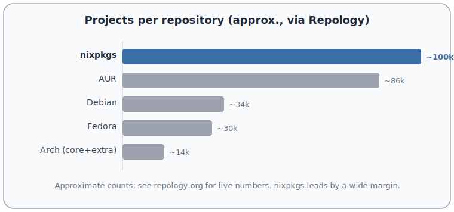
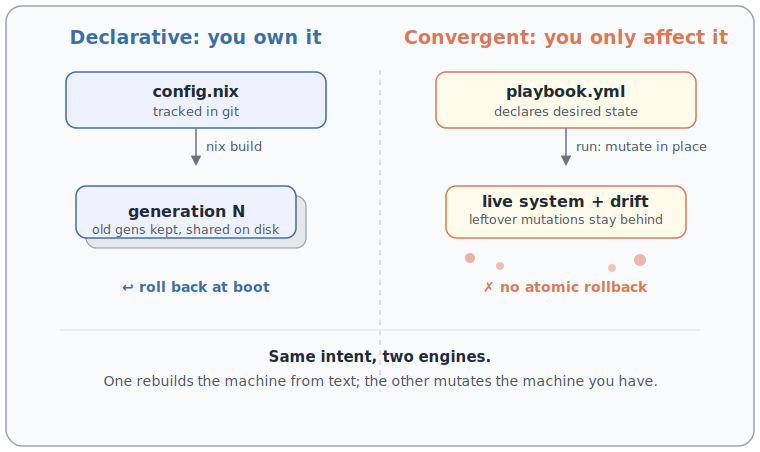

**My whole computer is one text file in git, and I rebuild it on any machine.** Linux for the drivers, <span class="gloss" tabindex="0">NixOS<span class="gloss-card"><span class="gc-head"><span class="gc-chip">n</span><span class="gc-name">NixOS</span></span><span class="gc-body">A Linux distribution whose entire system, from kernel to services to your desktop, is built from one declarative Nix configuration. Atomic upgrades and boot-menu rollbacks.</span><span class="gc-foot"><a href="https://nixos.org/" target="_blank" rel="noopener">nixos.org</a></span></span></span> to declare the machine, <span class="gloss" tabindex="0">XFCE<span class="gloss-card"><span class="gc-head"><span class="gc-chip">x</span><span class="gc-name">XFCE</span></span><span class="gc-body">A lightweight, traditional desktop environment for Linux. Fast, stable, and low on churn.</span><span class="gc-foot"><a href="https://www.xfce.org/" target="_blank" rel="noopener">xfce.org</a></span></span></span> and <span class="gloss" tabindex="0">zellij<span class="gloss-card"><span class="gc-head"><span class="gc-chip">z</span><span class="gc-name">zellij</span></span><span class="gc-body">A terminal multiplexer and workspace written in Rust: split panes, tabs, and detachable sessions, and it is scriptable.</span><span class="gc-foot"><a href="https://zellij.dev/" target="_blank" rel="noopener">zellij.dev</a></span></span></span> to actually work in it. The whole box is a repo, and I treat it like one.

This is the machine half of my stack. The development environment I build on top of it, Nix, git, and just, is a companion post: [My dev environment: Nix, git, just](/posts/dev-environment/).

I wrote this for people who suspect their operating system should be declarable and reproducible, and want to know how far that idea goes. It goes far, with a couple of honest caveats I will name as I hit them.

**TL;DR, the learnings:**

- **Declare the whole machine in one file.** NixOS builds it, versions it into generations, and rolls back from the boot menu.
- **The distro barely matters.** Pick a conservative base and bring Nix. Judge repositories by package breadth (Repology), not by theme.
- **Linux is unbeatable and too big to trust.** Great drivers and performance, an enormous kernel trust surface.
- **Ansible mutates; NixOS owns.** Convergent tools leave drift they cannot clean up.
- **Stay out of the desktop, live in the terminal.** XFCE that gets out of the way, and a programmable multiplexer (zellij) you can reattach to and let agents drive.
- **Reach machines over WireGuard, shell in with mosh, remote-desktop with xpra.**

## Linux: unbeatable, and too big to trust

On features, performance, and drivers, Linux is unbeatable. Nothing else comes close, so I run it. Eyes open.

Because the trust surface is enormous. There is far too much in the kernel. Why is a Bluetooth stack living in <span class="gloss" tabindex="0">ring zero<span class="gloss-card"><span class="gc-head"><span class="gc-chip">0</span><span class="gc-name">Ring zero</span></span><span class="gc-body">The most privileged CPU protection level, where the kernel runs. Code here can touch anything, so a bug here compromises the whole system.</span></span></span>? That does not make sense. Linux should take the <span class="gloss" tabindex="0">microkernel<span class="gloss-card"><span class="gc-head"><span class="gc-chip">µ</span><span class="gc-name">Microkernel</span></span><span class="gc-body">A kernel design that keeps only the essentials in privileged mode and runs drivers, filesystems, and stacks as ordinary user-space programs.</span></span></span> idea more seriously (<span class="gloss" tabindex="0">XNU<span class="gloss-card"><span class="gc-head"><span class="gc-chip">x</span><span class="gc-name">XNU</span></span><span class="gc-body">The kernel of macOS and iOS: a hybrid built on the Mach microkernel with a BSD layer on top.</span></span></span> or <span class="gloss" tabindex="0">Hurd<span class="gloss-card"><span class="gc-head"><span class="gc-chip">h</span><span class="gc-name">GNU Hurd</span></span><span class="gc-body">The GNU project's microkernel-based kernel: a set of servers running on top of the Mach microkernel.</span><span class="gc-foot"><a href="https://www.gnu.org/software/hurd/" target="_blank" rel="noopener">gnu.org/software/hurd</a></span></span></span>) and push drivers and stacks into user space. User space is easier to debug than the kernel, and a bug there has a smaller blast radius. In the kernel it is harder to debug and the security impact is far wider. Moving code out should be an ongoing effort, not a fantasy.

I also dislike how much Linux churns its own conventions. I miss the <span class="gloss" tabindex="0">principle of least astonishment<span class="gloss-card"><span class="gc-head"><span class="gc-chip">?</span><span class="gc-name">Least astonishment</span></span><span class="gc-body">A design rule: a system should behave the way its users expect, so nothing surprises them. Consistency over cleverness.</span></span></span> that FreeBSD holds to. But feature-wise, driver-wise, performance-wise, Linux wins, so I live with the trade.

## The distro barely matters: pick conservative, bring Nix

Pull up the [Repology graph](https://repology.org/repositories/graphs), which counts how many packages each repository actually carries and how fresh they are. That number should decide a distribution, not the desktop theme it ships with. You do not pick a distro for its theme any more than you pick a car for the stitching on the seats.

And the model behind those numbers is wasteful. Why do thousands of distributions each re-maintain the same package? Consolidate around a few good package managers instead. <span class="gloss" tabindex="0">nixpkgs<span class="gloss-card"><span class="gc-head"><span class="gc-chip">n</span><span class="gc-name">nixpkgs</span></span><span class="gc-body">The Nix Packages collection: one large, peer-reviewed git repository of build recipes that Nix draws from.</span><span class="gc-foot"><a href="https://github.com/NixOS/nixpkgs" target="_blank" rel="noopener">github.com/NixOS/nixpkgs</a></span></span></span> sits at the very top of that <span class="gloss" tabindex="0">Repology<span class="gloss-card"><span class="gc-head"><span class="gc-chip">r</span><span class="gc-name">Repology</span></span><span class="gc-body">A service that tracks which version of each package every distribution repository ships, and how up to date they are.</span><span class="gc-foot"><a href="https://repology.org/" target="_blank" rel="noopener">repology.org</a></span></span></span> chart, and Nix works on any distribution, so I bring Nix and stop caring what is underneath.



## NixOS: the whole machine in one file

Most config tools own a corner of your system: packages here, dotfiles there, a service over there. NixOS owns all of it. The kernel, a weird kernel config option you want turned on, the bootloader, the init system, your system services, and the GTK theme of your XFCE desktop: one file describes them, and you build the machine from it.

Say you want GitLab, <span class="gloss" tabindex="0">Jellyfin<span class="gloss-card"><span class="gc-head"><span class="gc-chip">j</span><span class="gc-name">Jellyfin</span></span><span class="gc-body">Free, self-hosted media server. Streams your own films, shows, and music to any device. An open alternative to Plex.</span><span class="gc-foot"><a href="https://jellyfin.org/" target="_blank" rel="noopener">jellyfin.org</a></span></span></span>, and <span class="gloss" tabindex="0">Home Assistant<span class="gloss-card"><span class="gc-head"><span class="gc-chip">h</span><span class="gc-name">Home Assistant</span></span><span class="gc-body">Open-source home-automation hub that runs locally and ties your smart devices together without a vendor cloud.</span><span class="gc-foot"><a href="https://www.home-assistant.io/" target="_blank" rel="noopener">home-assistant.io</a></span></span></span> running. You declare them as services and rebuild. No hunting for install guides, no leftover state.

```nix
# configuration.nix (excerpt)
{
  services.gitlab.enable         = true;
  services.jellyfin.enable       = true;
  services.home-assistant.enable = true;
}
```

Then `nixos-rebuild switch` reads that, builds the packages, writes the systemd units, and starts all three. (Each has more knobs, a data directory, a port, `openFirewall`, but the shape stays three declared services.) The rebuild does something no imperative tool can: it makes a new <span class="gloss" tabindex="0">generation<span class="gloss-card"><span class="gc-head"><span class="gc-chip">g</span><span class="gc-name">Generation</span></span><span class="gc-body">A NixOS generation: one complete, bootable build of your whole system. Each rebuild adds a new one and keeps the old, so you can roll back.</span></span></span> and leaves the old ones in place. Change something, rebuild, hate it, roll back. The rollback lives in your boot menu (GRUB or systemd-boot): pick the previous generation at boot and you are back, no reinstall. That is rollback without a special filesystem. No Btrfs or ZFS required. Nix stores each generation as content-addressed paths and shares everything unchanged between them, so keeping ten generations is cheap.

**And you can test it before you trust it.** Ask Nix to build a virtual machine from the same config and boot that first. Or ask for a Docker image, or a raw disk image, instead. Same description, many shapes, because a Nix config is a function and functions <span class="gloss" tabindex="0">compose<span class="gloss-card"><span class="gc-head"><span class="gc-chip">∘</span><span class="gc-name">Composition</span></span><span class="gc-body">Function composition: feeding one function's output into the next, so small parts combine into larger behavior. A Nix config is a function, so system variants compose from pieces.</span></span></span>. It is a real language, so you write asserts and generate config with code instead of pasting YAML. Put the file in git, and "works on my machine" stops being a shrug: you can see exactly what you declared, review it in a pull request, and reinstate the machine on new hardware.



## What I don't use: Ansible

**Ansible is a mutato: it mutates your machine and calls it management.** It sells a declarative YAML interface over a backend that cannot keep the promise, and that gap is the whole problem.

The YAML says "the system should look like this." The backend has to translate that onto dozens of Linux distributions it does not own. It only affects the system; it does not own it. So the limited YAML interface promises more than the backend can deliver, and the impedance mismatch leaks out.

It is convergent, which is correct in principle: run it and the system moves toward the described state. But it is not atomic, and it does not clean up. Comment out a task and the mutation it already made stays on your machine. You did not remove anything; you just stopped re-asserting it. Every run leaves your system a little more mutated and a little harder to know.

That model is fine for something you affect but cannot own: a network switch, a device you configure from the outside. For a switch, <span class="gloss" tabindex="0">Ansible<span class="gloss-card"><span class="gc-head"><span class="gc-chip">a</span><span class="gc-name">Ansible</span></span><span class="gc-body">An agentless configuration tool: you describe desired state in YAML and it SSHes into machines to converge them toward it.</span><span class="gc-foot"><a href="https://www.ansible.com/" target="_blank" rel="noopener">ansible.com</a></span></span></span> is genuinely nice. For a computer I own, it is the wrong tool. NixOS owns the machine, so it can actually remove what I stopped declaring.

## XFCE: a desktop that gets out of the way

Do not be fooled that more animation means more productivity. It does not. You get productive in the terminal, not in the desktop, so the desktop's only job is to stay out of the way.

XFCE does exactly that. It is efficient and it barely changes, because it converged years ago and there was nothing left to chase. It is not a <span class="gloss" tabindex="0">tiling window manager<span class="gloss-card"><span class="gc-head"><span class="gc-chip">▦</span><span class="gc-name">Tiling WM</span></span><span class="gc-body">A window manager that automatically arranges windows edge to edge with no overlap, like tiles, instead of free-floating windows.</span></span></span>, on purpose: I do not run a nuclear power plant, I do not want my screen to be a dashboard of ten things at once. I want to focus on one thing, and context-switch cleanly when I choose to. So I keep virtual desktops per concern, few windows each, and one graphical terminal (usually <span class="gloss" tabindex="0">Ghostty<span class="gloss-card"><span class="gc-head"><span class="gc-chip">g</span><span class="gc-name">Ghostty</span></span><span class="gc-body">A fast, GPU-accelerated terminal emulator.</span><span class="gc-foot"><a href="https://ghostty.org/" target="_blank" rel="noopener">ghostty.org</a></span></span></span>).

## zellij: efficient, programmable, and a little buggy

That one terminal is a window into a multiplexer, not a fragile session. Close it by accident, or lose the graphics entirely, and the work keeps running in the background; I reattach from another machine and pick up where I was. I use zellij for this, and I prefer it to tmux on efficiency.

Honest caveat: it is buggy. There are race conditions in the tab-bar names, and it does more than it should. I would like to fork a smaller, tighter surface of it one day.

What keeps me on it is that it is programmable. I can let an AI agent read a specific tab, drive a session, screenshot a terminal UI and operate it for a usability pass, all in the background. No graphical raster, no real screen needed: it works on the text, which is faster and works headless.

## Reaching the machines: WireGuard, mosh, xpra

All my machines sit on a <span class="gloss" tabindex="0">WireGuard<span class="gloss-card"><span class="gc-head"><span class="gc-chip">w</span><span class="gc-name">WireGuard</span></span><span class="gc-body">A fast, modern VPN built into the Linux kernel. A handful of keys and a few lines of config make one encrypted mesh.</span><span class="gc-foot"><a href="https://www.wireguard.com/" target="_blank" rel="noopener">wireguard.com</a></span></span></span> mesh, so any of them is one hop away and access is revocable with a single key. Over that I use <span class="gloss" tabindex="0">mosh<span class="gloss-card"><span class="gc-head"><span class="gc-chip">m</span><span class="gc-name">mosh</span></span><span class="gc-body">Mobile Shell: an SSH replacement that survives network drops and roaming, with predictive local echo so typing feels instant.</span><span class="gc-foot"><a href="https://mosh.org/" target="_blank" rel="noopener">mosh.org</a></span></span></span> instead of SSH: it survives outages, which matters on a spotty 4G or 5G link, and its predictive local echo short-cuts the keystroke-to-glyph path so characters appear as I type instead of after a round trip. When I need a real remote desktop, I use <span class="gloss" tabindex="0">xpra<span class="gloss-card"><span class="gc-head"><span class="gc-chip">x</span><span class="gc-name">xpra</span></span><span class="gc-body">"screen for X": run remote GUI apps and detach or reattach at will. It streams the display with a video codec like H.264.</span><span class="gc-foot"><a href="https://xpra.org/" target="_blank" rel="noopener">xpra.org</a></span></span></span>, because it encodes the stream with a video codec (h264): cheap on bandwidth, and cheap on CPU at both capture and decode.

## The principle: own, or affect

Every choice here collapses to one line: **own the machine declaratively, or affect it imperatively.** NixOS owns. Ansible affects. Owning means the state is one text in git, it rebuilds the same every time, and I can roll it back. Affecting means drift, and drift is where "works on my machine" is born.

Start small: put one machine's config in a Nix flake, commit it, and rebuild from git on a second box. When the second box comes up identical, you will feel the difference.

The tools I build with on top of this machine, Nix, git, and just, are the companion post: [My dev environment: Nix, git, just](/posts/dev-environment/).

Source: [nixos.org](https://nixos.org/), [zellij](https://zellij.dev/), [mosh](https://mosh.org/), [WireGuard](https://www.wireguard.com/), [xpra](https://xpra.org/).
