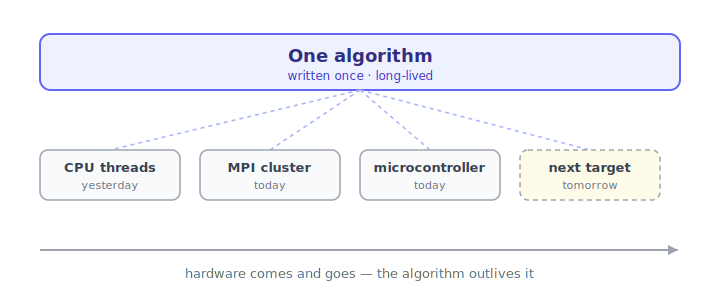
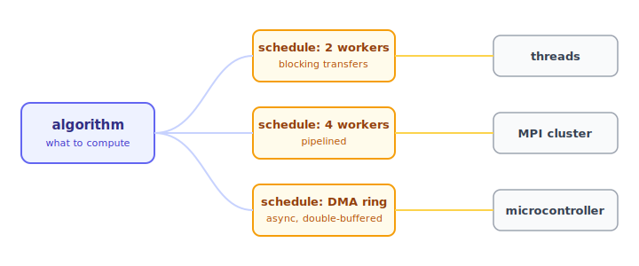

**Algorithms outlive the hardware they run on, yet every time we must port or
performance tune.** A signal-processing kernel stays stable for years. The chips
under it come and go.

So the same computation has to be ported. From CPU threads on a laptop, to a
message-passing cluster, to firmware in a microcontroller in an embedded device.
Hardware comes and goes. The algorithm stays.

This is for **systems code**: firmware and high-performance signal and data
processing.

## The problem

Moving an algorithm to new hardware means **rewriting it**.

The arithmetic is the cheap part. The glue around it is expensive. How data is
split across workers. How workers exchange results. Which **IO semanticsIOIO semanticsThe rules that govern how a data transfer behaves across a link: whether it blocks or runs async, is polled or event-driven, and how memory is shared.** govern
the exchange: blocking vs async, polled vs event-driven, shared memory vs DMADDirect Memory AccessHardware that moves data between memory and peripherals without involving the CPU, freeing it for other work.<a href="https://en.wikipedia.org/wiki/Direct_memory_access" target="_blank" rel="noopener">en.wikipedia.org</a>.

That glue is large and platform-specific. It is where deadlocksDDeadlockA standstill where two or more workers each wait forever for a resource the other holds, so none can proceed. and buffer
overruns hide. So the threads version, the cluster version, and the firmware
version become **three separate programs** that compute the same function. They
drift apart with every change.

## The idea: two files

Nucleus splits the program in two.

- The **algorithm** says *what* to compute. It names no workers, no buffers, no
  transports, no sync barriers.
- The **schedule** says *where, when, and how*. How many workers. How the data is
  partitioned. Which IO mechanism to use. This is the space and time
  decomposition.

**You change the schedule, not the algorithm.** The compiler writes the data
transfers for you. It works out the **halo regionsHHalo regionsThe border cells a worker must fetch from its neighbours so a stencil can compute values at the edge of its own partition.** a stencilSStencilA computation where each output cell is a fixed pattern of neighbouring input cells, as in convolutions and finite-difference solvers. needs from its
neighbours.

## Why this matters

Decomposition and IO are **decisions you make up front**. What runs where. What
runs when. How deep to **pipelinePPipelineSplitting work into stages that run concurrently, each stage handing its output to the next so their execution overlaps.**. Which **IO mechanism** to pick on each link.

These are expensive bets. In hand-written code they are baked into the source.
Changing one after the app ships is painful.

Nucleus makes them **dials**. To explore performance, edit a small file. Balance
the pipeline. Try a different decomposition. Swap a transport. Re-measure.

**Porting is then free.** To a new platform, if supported by nucleus-rs. Or to
the same platform with different performance characteristics.

## How it stays honest

A cheap port is worthless if it changes the result. Nucleus checks this on every
build.

- **Compile-time soundness.** Buffer overflows and deadlocks are caught at
  compile time, not in the field. For firmware with no OS to catch a fault, this
  matters.
- **A byte-identical test.** The same algorithm, under every schedule and
  backend, must produce the same bytes against an independent reference. One
  differing byte fails the build. It names the backend that disagreed.

Nucleus is a **clean-room Rust reimplementation** of the author's 2013 Intel MSc
work on compiling one source for multi-ASIPAASIPApplication-Specific Instruction-set Processor: a processor whose instruction set is tailored to one domain of algorithms. VLIWVVLIWVery Long Instruction Word: a CPU design where one instruction word issues several operations at once, with the parallelism scheduled by the compiler.<a href="https://en.wikipedia.org/wiki/Very_long_instruction_word" target="_blank" rel="noopener">en.wikipedia.org</a> chips, now carried across ten
backends instead of one.

Source: [github.com/eisbaw/nucleus-rs](https://github.com/eisbaw/nucleus-rs)
