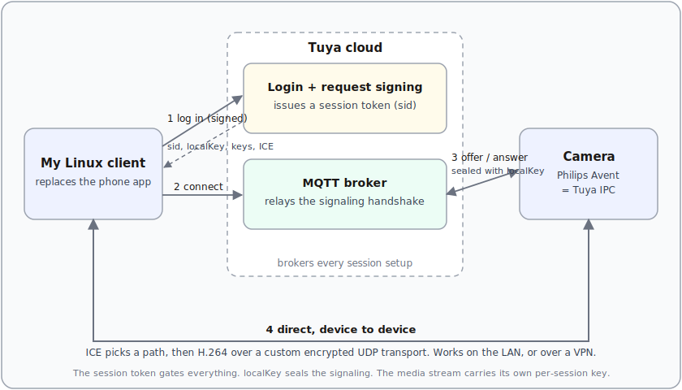

**I own a Philips Avent Baby Monitor+, and under the badge it is a Chinese Tuya camera.** It works well. But it is locked to a phone app and a vendor cloud, and that is not enough for a camera pointed at my child.

With a properly grounded negative-feedback loop and task management, Claude can easily reverse Android apps. Most of this reverse engineering ran autonomously: Claude worked it in a Ralph loop over about three days, with intermittent human guidance. Full reverse of the <span class="gloss" tabindex="0">Tuya<span class="gloss-card"><span class="gc-head"><span class="gc-name">Tuya</span></span><span class="gc-body">A Chinese IoT platform whose white-label cameras and cloud are re-badged and resold under many consumer brand names.</span><span class="gc-foot"><a href="https://www.tuya.com" target="_blank" rel="noopener">tuya.com</a></span></span></span> IP camera protocol, re-implemented in native Rust: [github.com/eisbaw/babymonitor-client](https://github.com/eisbaw/babymonitor-client). The AI methodology will be another blog post.

## What I wanted

Three things the official app will never give me.

I want my own analytics on the video: an estimate of his breathing rate, a count of how often he stirs, a log of when he wakes. I want a client on my own Linux box, because there is no Linux app and no website to open. And I want to know exactly **where the video goes**, because "it watches my child" is reason enough not to trust the vendor on it.

One more, on the wish list. I would like to reach the camera over my own VPN when I travel, instead of routing my baby's video through a cloud I do not control.

## What this is not

- Not a firmware hack. I reversed the phone client and the protocol, not the camera's firmware.
- Not a credential dump. All magic values are trivially extractable from the apk.

## It's a Tuya camera

Decompile the app and look. **Philips wrote almost none of it.**

Count the packages and the verdict is blunt: Philips' own code is a single file, and Tuya's is tens of thousands. The app is a re-skinned Tuya camera app. That is good news, because the protocol was never a Philips secret: it is Tuya's, people have picked Tuya apart before, and that gave me references to check my work against.

## How it works

So where does the video actually go? The cloud is in the loop for setup, and only for setup.

Here is the shape. The client logs in to Tuya's cloud and gets a session token. It uses that token to fetch the device list and each camera's config: the per-device keys and the connection candidates. It connects to a Tuya <span class="gloss" tabindex="0">MQTT<span class="gloss-card"><span class="gc-head"><span class="gc-name">MQTT</span></span><span class="gc-body">A lightweight publish/subscribe messaging protocol common in IoT, used here to broker the session setup between client and camera.</span><span class="gc-foot"><a href="https://mqtt.org" target="_blank" rel="noopener">mqtt.org</a></span></span></span> broker, which carries a <span class="gloss" tabindex="0">WebRTC<span class="gloss-card"><span class="gc-head"><span class="gc-name">WebRTC</span></span><span class="gc-body">A real-time framework for peer-to-peer audio, video and data, including the offer/answer handshake used to negotiate a connection.</span><span class="gc-foot"><a href="https://webrtc.org" target="_blank" rel="noopener">webrtc.org</a></span></span></span>-style offer-and-answer handshake. The camera answers, both sides trade <span class="gloss" tabindex="0">ICE candidates<span class="gloss-card"><span class="gc-head"><span class="gc-name">ICE candidates</span></span><span class="gc-body">Interactive Connectivity Establishment: the set of candidate IP and port pairs two peers exchange to discover a working direct path through NATs and firewalls.</span></span></span>, and a direct path opens. Over that path the video flows as <span class="gloss" tabindex="0">H.264<span class="gloss-card"><span class="gc-head"><span class="gc-name">H.264</span></span><span class="gc-body">A widely used video compression codec, also called AVC, that encodes the raw camera frames into a compact byte stream.</span></span></span> inside a custom UDP transport, encrypted one segment at a time:

```
each UDP datagram, per KCP segment:
[ 16-byte IV | AES-128-CBC ciphertext | 20-byte HMAC-SHA1 ]
```



Notice the detail that matters for the VPN idea: **the media path is genuinely peer-to-peer.** In one capture the video went straight to the camera's address on my LAN, with no relay in the middle. The cloud sets the session up. It does not carry the pixels.

## How I reversed it

The Tuya app is hard, and one technique is not enough. You need two, and a rule for when they fight.

Do the static pass first. Pull the install package apart, decompile the Java with <span class="gloss" tabindex="0">jadx<span class="gloss-card"><span class="gc-head"><span class="gc-name">jadx</span></span><span class="gc-body">A decompiler that turns Android DEX bytecode back into readable Java source.</span><span class="gc-foot"><a href="https://github.com/skylot/jadx" target="_blank" rel="noopener">github.com</a></span></span></span>, and disassemble the native crypto libraries with <span class="gloss" tabindex="0">Ghidra<span class="gloss-card"><span class="gc-head"><span class="gc-name">Ghidra</span></span><span class="gc-body">A free reverse-engineering suite from the NSA for disassembling and decompiling native binaries.</span><span class="gc-foot"><a href="https://ghidra-sre.org" target="_blank" rel="noopener">ghidra-sre.org</a></span></span></span>. This is reading the code at rest, and the app fights you: the code is heavily obfuscated, the logic is smeared across a native SDK and a pile of JavaScript on an embedded engine, the signing key is built partly from a value hidden inside a bitmap (decoded with bignum-and-matrix math), and the app refuses to run rooted or emulated. It even hunts for the debugger you would point at it.

Then watch it run. Boot a rooted Android emulator, patch out the anti-tamper checks, strip the <span class="gloss" tabindex="0">TLS pinning<span class="gloss-card"><span class="gc-head"><span class="gc-name">TLS pinning</span></span><span class="gc-body">A defense where an app trusts only one specific server certificate, blocking the man-in-the-middle proxies normally used to inspect its encrypted traffic.</span></span></span>, and capture the real conversation. Static analysis tells you what the code could do. The live capture tells you what it does.

Two disagreements paid for the project. After four rounds of reading the code, I was sure login was blocked by a server-side identity check no home-made client could pass. Then I watched the wire: it was my own bug, a single field sliced to the wrong length. The code also swore the video used standard WebRTC encryption; the wire showed a custom transport. **The wire won.** It always does.

## Where it stands

It streams. The client connects to my camera and plays **live 1080p video and audio** on my own Linux box, the one place the vendor never shipped an app or a website. Under the hood it decrypts the camera's <span class="gloss" tabindex="0">KCP<span class="gloss-card"><span class="gc-head"><span class="gc-name">KCP</span></span><span class="gc-body">A reliable, low-latency transport protocol layered over UDP, trading extra bandwidth for lower latency than TCP.</span><span class="gc-foot"><a href="https://github.com/skywind3000/kcp" target="_blank" rel="noopener">github.com</a></span></span></span> and AES stream, reassembles the H.264, and decodes it, all byte-checked against a real capture.

That was the point: the frames are mine now. Next comes what I wanted them for, **<span class="gloss" tabindex="0">OpenCV<span class="gloss-card"><span class="gc-head"><span class="gc-name">OpenCV</span></span><span class="gc-body">An open-source computer-vision library for image and video analysis.</span><span class="gc-foot"><a href="https://opencv.org" target="_blank" rel="noopener">opencv.org</a></span></span></span> on my own machine**: his breathing rate, how often he stirs, when he wakes. The picture stops being something I only watch and becomes something I can measure.

Source: the full Rust client and reverse-engineering notes are on GitHub at [eisbaw/babymonitor-client](https://github.com/eisbaw/babymonitor-client).
