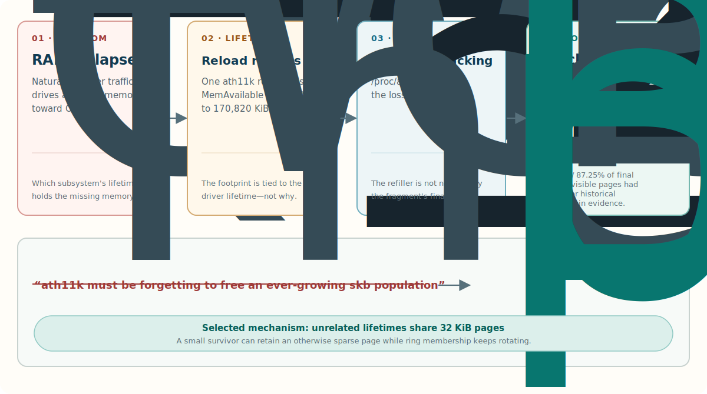
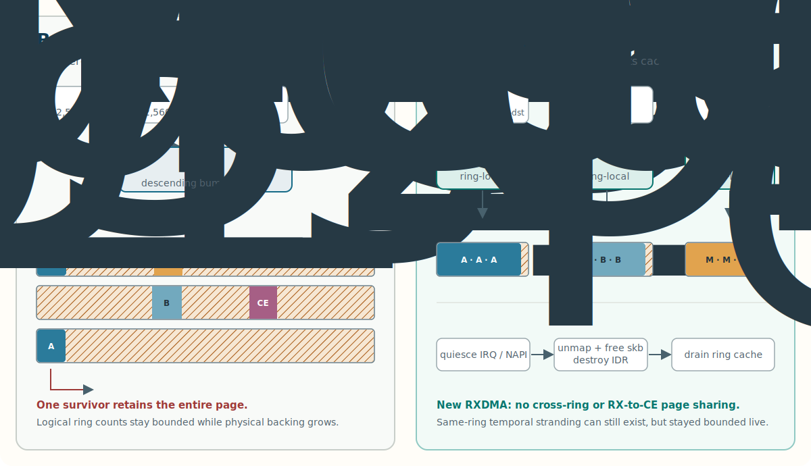
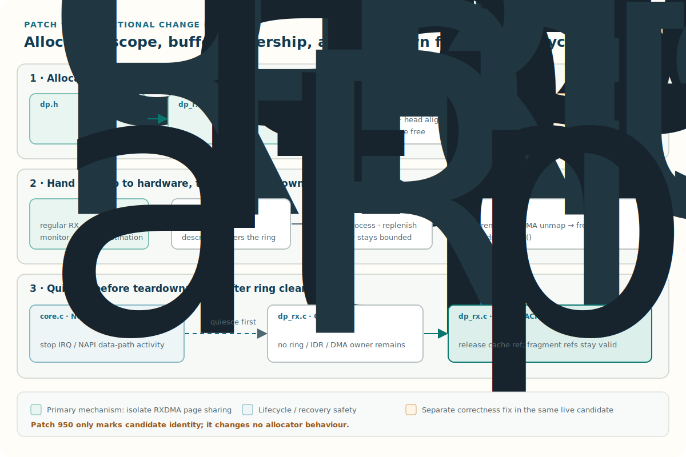

**A Linksys MX4200 was losing 12 to 16 MB of RAM every minute, and every clue pointed at an ath11k buffer leak. Every clue was wrong.**

One driver reload moved `MemAvailable` from 3,348 to 170,820 KiB: more than 160 MiB back at once. That is a persuasive number. It made "ath11k leak" the obvious name, because the memory was clearly tied to the driver's lifetime. But it never said the driver had forgotten to free 160 MiB of objects. When I finally tracked the buffers generation by generation, the receive rings were not growing at all. The missing memory was real. The first model was not.

I run this <span class="gloss" tabindex="0">MX4200<span class="gloss-card"><span class="gc-head"><span class="gc-name">Linksys MX4200 v1</span></span><span class="gc-body">A Wi-Fi 6 tri-band mesh router. This is the v1 hardware (Qualcomm IPQ807x, ath11k radios); later revisions differ, so the OpenWrt image is version-specific.</span><span class="gc-foot"><a href="https://openwrt.org/toh/linksys/mx4200_v1_and_v2" target="_blank" rel="noopener">openwrt.org</a></span></span></span> as an <span class="gloss" tabindex="0">OpenWrt<span class="gloss-card"><span class="gc-head"><span class="gc-name">OpenWrt</span></span><span class="gc-body">A Linux distribution for embedded routers and access points, replacing the vendor firmware with a full package-managed userland.</span><span class="gc-foot"><a href="https://openwrt.org" target="_blank" rel="noopener">openwrt.org</a></span></span></span> repeater: one station uplink, two access points, a bridge, and `relayd`. Under ordinary household traffic it shed nearly all its memory, killed `hostapd`, and eventually hit OOM or the watchdog. This is the story of chasing that leak to a bug that was not a leak. It is for anyone who has watched memory vanish while every object counter stayed flat.

## TL;DR

- **A bounded object count can pin far more memory than its nominal size suggests.** The receive rings held a fixed number of buffers while the physical pages under them kept growing toward a much higher cap.
- **The allocator was the amplifier, not a leaker.** `dev_alloc_skb()` cut fragments from a shared per-CPU page cache. One long-lived fragment keeps a whole 32 KiB page alive.
- **Pointer-only traces lied.** Reused addresses look like immortal objects. You need generation-safe identity before you trust a single "never freed" claim.
- **The fix matches allocator lifetime to ring lifetime.** Give each receive ring its own page-fragment cache so unrelated lifetimes stop co-packing onto one page.
- **A separate `skb_pull` -> `skb_reserve` bug rode along.** The alignment call was a silent no-op on an empty skb.
- **Prove it three ways.** Ownership tracking, a userland model, and a guarded live gate all have to agree. No single probe is enough.
- **Ring-size fixes came first.** Earlier low-memory ath11k work reduced ring capacity. My patch keeps the stock capacities and instead separates allocation domains.

## The failure looked exactly like a leak

The most convincing early experiment was also the source of the misleading name. Reload <span class="gloss" tabindex="0">ath11k<span class="gloss-card"><span class="gc-head"><span class="gc-name">ath11k</span></span><span class="gc-body">The mainline Linux driver for Qualcomm 802.11ax (Wi-Fi 6) chipsets, including the ones in the MX4200.</span><span class="gc-foot"><a href="https://wireless.wiki.kernel.org/en/users/drivers/ath11k" target="_blank" rel="noopener">wireless.wiki.kernel.org</a></span></span></span> and 160 MiB comes back. Tear the driver down and the memory frees, so the memory belongs to the driver. That is true, and it is not the same claim as "the driver leaks."

To split those two claims apart, I had to narrow the question one layer at a time: which lifetime owns the memory, which physical allocation backs it, and whether the logical population behind it was actually growing.



Three numbers set the stage. Memory fell at roughly **12 to 16 MB per minute** under natural load. One reload recovered **163.5 MiB**. And once I could see all six receive rings at once, the total posted inventory was **15,357 buffers**: three regular rings of 4,095 and three monitor rings of 1,024. That inventory never grew. Hold that fact next to "memory keeps falling" and the whole puzzle is in the gap between them.

## A flat count can pin a growing pile of memory

Receive rings are meant to be full. A packet arrives, one buffer leaves the ring, a replacement is posted. The count stays flat forever while the identity and age of its members rotate. So a stable count tells you nothing about how much physical memory is pinned.

Here is the mechanism. The buffer heads were not one independently freeable allocation each. `dev_alloc_skb()` draws fragments from a shared per-CPU <span class="gloss" tabindex="0">page-frag cache<span class="gloss-card"><span class="gc-head"><span class="gc-name">page-frag cache</span></span><span class="gc-body">A kernel allocator that hands out small slices of a larger backing page by bumping an offset. The backing page is freed only when every slice cut from it has been released.</span></span></span>, and on this kernel it commonly served those slices out of 32 KiB <span class="gloss" tabindex="0">order-3 pages<span class="gloss-card"><span class="gc-head"><span class="gc-name">order-3 page</span></span><span class="gc-body">A physically contiguous block of 2^3 = 8 base pages (32 KiB on a 4 KiB-page system), allocated as one unit by the buddy allocator.</span></span></span>. A page is reclaimable only when every fragment on it is gone.

<span class="gloss" tabindex="0">skb<span class="gloss-card"><span class="gc-head"><span class="gc-name">skb</span></span><span class="gc-body">sk_buff, the kernel's socket buffer: the structure that carries one network packet and points at the memory holding its data.</span></span></span> heads for different traffic classes landed on the same page. Regular receive, monitor traffic, and Copy Engine control traffic all have different turnover. A fragment from one class can outlive short-lived neighbours from another class, and then a nearly empty 32 KiB page sits there, held alive by a single survivor.

That is allocator amplification, or page stranding. It is not a missing final free. The count is honest; the physical footprint is pathological anyway.

Think of a filing drawer packed with twelve folders. Eleven are processed and pulled fast; one belongs to a slow queue. The eleven empty slots cannot be returned as a drawer, because the one slow folder pins it. Rotate a fixed number of folders through that pattern and the number of live folders stays flat while occupied drawers climb toward the expensive limit where almost every survivor pins its own drawer.



## Finding the bytes, and why my first traces lied

Counting was never going to settle this. I needed physical accounting.

A debug kernel with `/proc/allocinfo` gave me the first hard number. Bytes attributed to `__page_frag_cache_refill` rose nearly one-for-one as `MemAvailable` fell. Slab did not. Vmalloc did not. That localized the footprint to page-frag backing. It did not name the owner that kept each page alive, and that distinction is the whole trap: allocinfo names the code that *refilled* a shared page, but the next fragment off that page may be consumed by an entirely different path. Treat the refiller as the holder and you will indict innocent code. For a while the monitor-status and Copy Engine paths looked guilty, and both had bounded rings and balanced refills.

The skb traces lied too, in a more embarrassing way. My first pointer-only analysis showed old, never-freed skbs everywhere. They were ghosts. Three defects made them: the analysis missed `ieee80211_free_txskb()`, it did not separate reused pointers into generations, and some trace files were concatenated or truncated. A pointer is an address, not an identity across time. The same address gets handed out again and looks immortal.

So I built a diagnostic, [`rxown`](https://github.com/eisbaw/ath11k-page-frag-fix/blob/main/tools/rxown.c), that tracked generations through the whole lifecycle: allocation, <span class="gloss" tabindex="0">IDR<span class="gloss-card"><span class="gc-head"><span class="gc-name">IDR</span></span><span class="gc-body">The kernel's ID-to-pointer map. ath11k uses one per ring to hand each posted buffer a small integer handle for the hardware to return on completion.</span></span></span> insertion, DMA posting, reap, skb release, and physical-page history. Across two independent memory sawtooths, all 26 snapshots passed their integrity gates. Allocations equalled posts. The IDRs stayed bounded. The reaped-but-not-released count stayed at zero. Within the tracked RXDMA lifecycles, there was no accumulating unmatched-buffer population.

What the tracker *did* find was cross-origin evidence: at the final snapshot of cycle 1, 1,547 of 1,789 tracked pages (86.47%) carried current or historical fragments from more than one owner. Cycle 2 read 1,745 of 2,000 (87.25%).

Read those percentages narrowly. They are lower bounds among the pages the tracker could see, not a fraction of every allocinfo page, and not a promise to recover 86% of memory. Tracking started after buffers already existed, so the evidence is right-censored. It points at the mechanism; it does not size the prize.

## The mechanism, at the source

The relevant path starts in ath11k's refill loops. Regular receive and monitor-status buffers both called `dev_alloc_skb()`, which on Linux 6.12 reaches the network page-fragment allocator and its per-CPU cache. A refill takes aligned slices from a backing page until the cache rolls to the next one.

```c
/* Before: unrelated RXDMA rings enter one shared allocator lane. */
skb = dev_alloc_skb(DP_RX_BUFFER_SIZE +
                    DP_RX_BUFFER_ALIGN_SIZE);
```

A 2,560-byte ath11k head and a 2,432-byte control head can share one 32 KiB page. Refcounts keep the page alive until its last fragment goes. The kernel is doing exactly what it was told. The mismatch is upstream of it: a long-lived, continuously rotated ring inventory is allowed to co-pack with unrelated <span class="gloss" tabindex="0">RXDMA rings<span class="gloss-card"><span class="gc-head"><span class="gc-name">RXDMA ring</span></span><span class="gc-body">A receive DMA descriptor ring. The driver posts empty buffers into it and the Wi-Fi hardware fills them with incoming packets, wrapping around the ring continuously.</span></span></span> and control traffic, so correct reference counting still yields a bad physical footprint.

This finally explained two things that had annoyed me. Memory sometimes returned in large batches with no reload, when the last survivor on several sparse pages happened to disappear together. And a reload returned far more, because tearing down every ring at once closed all the remaining lifetimes.

## The fix: match allocator lifetime to the ring

The patch changes the unit of sharing. Each `dp_rxdma_ring` gets its own page-frag cache, and both regular receive and monitor-status refill through an allocator that takes the owning ring.

```c
struct dp_rxdma_ring {
        struct dp_srng refill_buf_ring;
        struct page_frag_cache frag_cache;
        struct idr bufs_idr;
        ...
};

skb = ath11k_dp_rx_alloc_skb(rx_ring,
                             DP_RX_BUFFER_SIZE +
                             DP_RX_BUFFER_ALIGN_SIZE);
```

This is not a blind call swap. The ring-local helper keeps the allocation contract ath11k relied on: `GFP_ATOMIC | __GFP_NOWARN`, conditional `__GFP_MEMALLOC`, `NET_SKB_PAD`, `SKB_HEAD_ALIGN()`, `build_skb()`, and a `page_frag_free()` on the failure path. The existing SRNG lock already serializes refill into a given ring's cache, so I did not add locking.



**Fix 1: isolate the ownership domains.** New fragments for different rings can no longer land on the same page, and a receive fragment can no longer share a fresh page with control traffic. That removes the observed cross-origin amplification by construction. It does not claim to stop a slow member of one ring stranding pages behind newer members of that same ring. Same-ring stranding is still possible; it just stayed bounded in practice.

**Fix 2: drain only after the ring is dead.** A private cache needs a private teardown. The patch calls `page_frag_cache_drain()` only after the ring's skbs are DMA-unmapped and freed and the buffer IDR is destroyed. On the non-reset crash-recovery path it first calls `ath11k_hif_irq_disable()`, so <span class="gloss" tabindex="0">NAPI<span class="gloss-card"><span class="gc-head"><span class="gc-name">NAPI</span></span><span class="gc-body">The Linux network polling mechanism: under load the driver stops taking one interrupt per packet and polls the ring in softirq context instead.</span></span></span> and IRQ processing cannot keep touching the data path mid-teardown. The normal destroy and reset paths already quiesced it.

**Fix 3: use the right API for alignment.** The same audit turned up a separate, concrete bug. ath11k tried to align the data pointer with `skb_pull()` right after allocation, when the skb was empty and its length was zero. A positive pull on a zero-length skb fails and leaves the pointer untouched, and the ignored return value hid the no-op.

```c
/* Before: no movement on an empty skb, return value ignored. */
skb_pull(skb, PTR_ALIGN(skb->data, 128) - skb->data);

/* After: reserve headroom while the skb is still empty. */
skb_reserve(skb, PTR_ALIGN(skb->data, 128) - skb->data);
```

`skb_reserve()` is the correct move on an empty skb. The extra 128 allocation bytes keep at least `DP_RX_BUFFER_SIZE` of DMA tailroom after the shift. It is a real fix, but it shipped in the same candidate as the cache isolation, so the live experiment cannot credit it a separate slice of the improvement. Honest limits matter more than a clean attribution.

## Reproducing the mechanism in userland

Live traffic is noisy: packet timing, ring selection, allocator reuse, and memory pressure all move together, so a live run cannot isolate policy from load. So I wrote a deterministic Python model, [`pagefrag_sim.py`](https://github.com/eisbaw/ath11k-page-frag-fix/blob/main/simulator/pagefrag_sim.py) (with a [test suite](https://github.com/eisbaw/ath11k-page-frag-fix/blob/main/simulator/test_pagefrag_sim.py) pinning its behaviour). It generates one logical stream of allocations, posts, reaps, releases, and cache events, then replays that identical stream through four policies: shared cache, per-ring cache, same-ring-only isolation, and non-page-frag allocation.

The model implements the Linux 6.12 page-frag behaviour that matters here: 32 KiB order-3 pages, descending offsets, bias and refcount rollover, reuse, drain, pfmemalloc handling, and order-0 fallback. On seed 17 over 300 simulated seconds, with an identical final population of 15,659 live and 15,357 posted buffers, the shared cache retained **169.688 MiB** of total backing with **131.458 MiB** of slack. Per-ring caches retained **76.906 MiB**, including **38.676 MiB** of slack.

Same logical state, less than half the physical backing. That is the mechanism in one line: allocation policy alone moves the byte count while the object count is pinned. The model does not predict the router's exact numbers, and it cannot prove the kernel patch safe. For that I needed a real build on the real box.

## Live validation

Remote kernel-module surgery can strand a router you cannot walk over to. So the [deploy controller](assets/deploy-ath11k-private-cache.sh) kept the stock modules installed, armed automatic rollback, and staged an on-router [guard](assets/ath11k-private-cache-guard.sh) (with a [liveness check](assets/ath11k-private-cache-liveness.sh)) that gated on module identity, memory, reachability, expected Wi-Fi roles, watchdog state, and fatal kernel logs. A [fault-injection harness](assets/test-ath11k-private-cache-deploy.sh) exercised nineteen failure and recovery cases before the real gate. These scripts are published as evidence snapshots of one build-specific deployment: their module paths, hashes, thresholds, and topology placeholders must not be treated as a portable installer. A [second patch](https://github.com/eisbaw/ath11k-page-frag-fix/blob/main/patches/950-wifi-ath11k-mark-private-rxfrag-validation-build.patch) adds a `private_rxfrag=Y` marker so the guard can prove the candidate module, not the stock one, was loaded.


The endpoints:

- **Pre-fix, 240.1 s:** `MemAvailable` fell 46,768 -> 20,996 KiB while page-frag backing grew 29,229,056 bytes. It batch-recovered about 96 seconds later with no reload.
- **Candidate gate, 1,790 s:** 156,464 -> 159,748 KiB across 168 samples, bounded, with no memguard reload.
- **Second load, 289 s:** 148,612 -> 157,388 KiB, another bounded window with zero memguard events.

A timestamped check after 32,993 seconds of uptime read 157,728 KiB available, 81,494,016 bytes of page-frag backing, the candidate marker present, and zero reloads. That is one healthy point after nine hours, not a continuous nine-hour trace. I will not oversell a spot check.

## Prior work: shrinking rings versus separating lifetimes

I was not the first person to stabilize ath11k on a memory-constrained router by changing its receive rings. The earliest implementation I found is [hzyitc's 2024 patch](https://github.com/hzyitc/openwrt-redmi-ax3000/commit/442f0e252c6443358af49711c04ce15707784f58), which reduces several TX, RX, and monitor rings and later became a configurable [OpenWrt small-buffers proposal](https://github.com/openwrt/openwrt/pull/21495). [Yanko Yankulov's MR80X patch](https://github.com/yanko-yankulov/openwrt-mr80x/commit/ee7747f48999cae66e686d464dceaf838398309e) independently made more aggressive RX-ring reductions for a 256 MiB IPQ5018 device.

Most directly, [EnSpect's initial MX4200 report](https://github.com/enspect/ath11k-ipq807x-rx-buffer-oom-fix/commit/c97963ace0a4ff74c4c9accb9cad547b9ab5421b) was public on 9 July 2026, two days before my investigation's recorded 11 July start. Its [page-allocator diagnosis](https://github.com/enspect/ath11k-ipq807x-rx-buffer-oom-fix/blob/77a7f1d58e74a7b4f3dfe2a3682ae575e4c2e884/README.md#root-cause) connects the MX4200 failure to page-frag-backed ath11k buffers, and its [live result](https://github.com/enspect/ath11k-ipq807x-rx-buffer-oom-fix/blob/77a7f1d58e74a7b4f3dfe2a3682ae575e4c2e884/README.md#results) shows that halving several rings stabilized that deployment. That is prior art for the symptom, allocator attribution, and ring-shrink mitigation. I make no priority claim over it.

The two patches operate on different boundaries. Shrinking rings lowers the maximum posted-buffer inventory and worst-case retained footprint, at the cost of buffering headroom. Patch 949 leaves the stock capacity constants unchanged and instead prevents new fragments from different RXDMA rings, or RXDMA and Copy Engine traffic, from sharing a backing page. It copies none of the earlier ring-size changes.

There is also a trap in applying the EnSpect patch verbatim: `DP_RXDMA_REFILL_RING_SIZE` is passed to firmware as a receive-buffer byte size in this ath11k source, not used as an SRNG capacity. Halving it is not a host-memory ring reduction and may change the firmware buffer contract. The useful prior-art lesson is the capacity trade-off, not that every edited constant is a ring count.

## What this proves, and what it does not

The integrated candidate stopped the observed failure under this MX4200's natural repeater workload. Ownership evidence and the simulator both select cross-origin lifetime mixing as the primary mechanism. Those are strong, converging results. They are not a universal theorem about every ath11k device or traffic mix.

- **Same-ring stranding remains possible.** Private caches isolate domains; they do not force every fragment in one ring to share a lifetime.
- **The candidate was integrated.** Cache isolation and the alignment fix were not live-tested apart.
- **The simulator is mechanism-only.** Synthetic hold times make its absolute byte totals unfit as forecasts.
- **The nine-hour result is a snapshot.** One immutable status file, not every moment in between.
- **Mitigations stayed on.** Memguard and `rx-gro-list=off` were kept as safety controls, and neither is the root fix.

Here is the reusable lesson. When memory grows but object counters do not, stop asking only "which object was not freed." Ask "which physical allocation unit is still pinned, and which unrelated lifetimes got packed into it." Then make identity generation-safe, keep the allocator distinct from the eventual owner, and demand that logical state, physical backing, and live outcome all agree before you believe any of them.

## Apply it yourself

This patch is not upstream and has not been through review. I am publishing it because independent low-memory ath11k reports show that the broader failure shape is not unique to my router. That does not mean every busy ath11k access point has this allocator-lifetime mechanism. If your measurements match, here is how to try it. Test before you trust it, especially on a box you cannot physically reach.

First confirm you actually have this bug, because the fix is worthless for a different leak. On a kernel with `CONFIG_MEM_ALLOC_PROFILING`, watch `/proc/allocinfo` under load:

```sh
# Bytes charged to the page-frag refill path, sampled over time.
grep __page_frag_cache_refill /proc/allocinfo
```

If that number climbs roughly in step with a falling `MemAvailable`, slab and vmalloc stay flat, and an `ath11k` reload snaps the memory back, you have enough overlap to justify ownership tracing or a guarded A/B test—not proof that the mechanism is identical. The patch is [`949-wifi-ath11k-use-private-page-frag-caches-for-rxdma.patch`](https://github.com/eisbaw/ath11k-page-frag-fix/blob/main/patches/949-wifi-ath11k-use-private-page-frag-caches-for-rxdma.patch). It touches three files (`core.c`, `dp.h`, `dp_rx.c`) and carries the `skb_reserve` alignment fix with it. This is the whole tested candidate. My tree also has [patch 950](https://github.com/eisbaw/ath11k-page-frag-fix/blob/main/patches/950-wifi-ath11k-mark-private-rxfrag-validation-build.patch), but it only adds the `private_rxfrag=Y` module marker my deploy guard reads; it changes no behaviour, so you do not need it for the fix.

On **OpenWrt**, ath11k ships from the mac80211 backports package, so drop the patch in and rebuild that one package:

```sh
cp 949-wifi-ath11k-use-private-page-frag-caches-for-rxdma.patch \
   package/kernel/mac80211/patches/ath11k/
make package/kernel/mac80211/{clean,compile} V=s
# then flash the rebuilt kmod-ath11k, or the full image
```

The patch was generated and tested against OpenWrt's `backports-6.18.26` ath11k tree on Linux 6.12.87. Do not assume it applies unchanged to a mainline or vendor tree: port the individual source changes to that tree, review its allocator and teardown APIs, and use that tree's normal module build procedure.

Then load the module and re-run the same `allocinfo` check under real traffic. In my workload the refill backing stayed bounded and `MemAvailable` stopped its slide; yours is an experiment until its measurements say the same. Keep a rollback path armed while you test, because a bad ath11k module can take Wi-Fi (and your way back in) down with it. And remember the honest limit: this isolates cross-ring mixing, not stranding inside a single ring. It fixed my measured workload; it is not a proof for yours.

### If you cannot patch yet

Rebuilding a kernel takes time, and until then the box still needs to stay up. The stopgap is to reload the driver on a timer, because tearing down every ring frees the stranded pages. Two small shell scripts do it. [`ath11k-reload.sh`](assets/ath11k-reload.sh) reloads the whole stack (it drops the uplink for 10 to 20 seconds, so it must run detached or it dies mid-reload when its own SSH path goes away). [`ath11k-memguard.sh`](assets/ath11k-memguard.sh) runs as a long-lived loop, samples `MemAvailable` every 30 seconds, and calls the reload only when it falls below a threshold, with a minimum gap to stop it thrashing. Keep the hardware watchdog armed underneath as the last resort. This is a crutch, not a fix: it papers over the bleed instead of stopping it, and every reload is a brief outage. Patch when you can.

If you run any of this and it helps (or does not), that data point is useful.

Canonical source and normalized evidence for both patches, `rxown`, and the simulator live at [github.com/eisbaw/ath11k-page-frag-fix](https://github.com/eisbaw/ath11k-page-frag-fix). The deployment, guard, liveness, and fault-injection downloads attached to this post are archival snapshots intentionally omitted from that repository because they encode one build's rollout procedure. Next time your RAM is leaving and nothing is leaking, go count pages, not objects.
